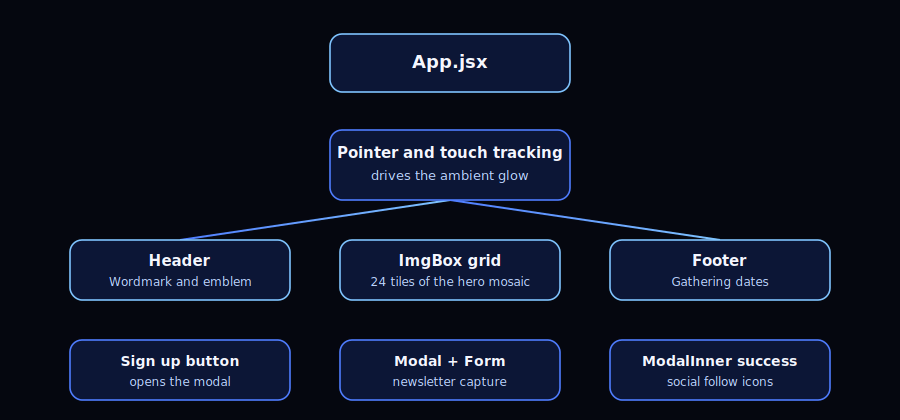
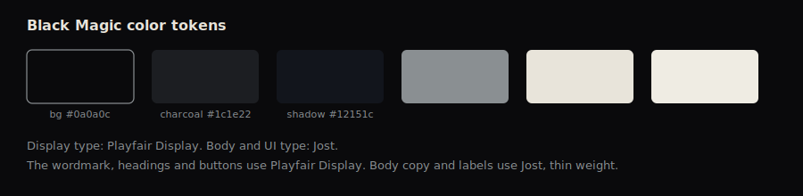

https://github.com/user-attachments/assets/891317fa-75f1-443e-993b-de93e4120bfd

# Black Magic

[](https://github.com/hassanireza/blackMagic-main/actions/workflows/deploy.yml)
[](https://hassanireza.github.io/blackMagic-main)
[](https://react.dev/)
[](https://www.typescriptlang.org/)
[](https://vitejs.dev/)
[](https://styled-components.com/)
[](https://nodejs.org/)

An interactive teaser site for Black Magic, built as a single scroll free experience where a mosaic image reassembles itself as the visitor moves their cursor or finger across the screen. This version is a full rebuild of the original Create React App project onto Vite, TypeScript, and a layered OOP architecture.



## Table of contents

- [Overview](#overview)
- [Live experience](#live-experience)
- [Architecture](#architecture)
- [Design system](#design-system)
- [Tech stack](#tech-stack)
- [Project structure](#project-structure)
- [Getting started](#getting-started)
- [Available scripts](#available-scripts)
- [Deployment](#deployment)
- [Browser support](#browser-support)
- [License](#license)

## Overview

Black Magic is a small, self contained React application. There is no router, no backend, and no build time content pipeline beyond Vite. The experience lives in a handful of components backed by a plain TypeScript class layer:

- A hero mosaic made of twenty four tiles that drift apart at rest and snap together into a single image as the visitor's cursor approaches the center of the screen.
- A wordmark and emblem in the header, drawn as a single inline SVG so it stays crisp at any size.
- A footer that frames the gathering dates for the next event.
- A sign up modal with a lightweight form and a follow up screen with social links.

## Live experience

The interaction is driven by one calculation, encapsulated in the `PointerTracker` class. On every pointer or touch move, `PointerTracker` measures how close the cursor is to the center of the viewport and turns that distance into an eased value between zero and one. That value:

1. Spreads or gathers the twenty four mosaic tiles, as though a figure is surfacing from water.
2. Deepens or lifts the background tone, so the whole page breathes with the motion.
3. Triggers a soft, slow glow once the tiles are fully aligned.

On load, the header, footer, and mosaic fade up out of black with a slow, critically damped easing curve rather than sliding or bouncing into place, echoing the way the source photograph itself emerges from darkness.

## Architecture

The rebuild separates plain TypeScript logic from React presentation:

- `src/core/PointerTracker.ts` turns pointer or touch coordinates into an eased closeness-to-center value.
- `src/core/MosaicGrid.ts` owns the tile matrix and generates each tile's randomized drift vector.
- `src/core/SignupFormController.ts` models the two-stage signup flow (idle to submitted) independently of any component.
- React components (`App`, `Mosaic`, `Header`, `Footer`, `Modal`, `ModalInner`, `Form`) stay thin: they hold view state, wire up event handlers, and hand the real work off to the classes above.

Each core class is unit tested in isolation under `src/core/__tests__`, with no rendering or DOM involved.

## Design system



The site follows a near monochrome, editorial art direction: a bleached, ritualistic photograph emerging from total darkness, so the palette stays desaturated and the type stays quiet.

| Token | Value | Used for |
| --- | --- | --- |
| Background | `#0a0a0c` | Page background, near black |
| Charcoal | `#1c1e22` | Emblem gradient, dark UI text on paper |
| Shadow blue | `#12151c` | Ambient tone shift as the cursor moves |
| Bone | `#e8e4da` | Primary text on dark backgrounds |
| Silver | `#8a8f92` | Borders, secondary accents, glow |

Typography pairs a serif display face, Playfair Display, for headings and the sign up button, with a thin weight sans, Jost, for body copy and labels.

## Tech stack

- React 18 with function components and hooks
- TypeScript in strict mode
- Vite for dev server and production bundling
- styled-components for CSS-in-JS, themed with CSS custom properties
- vite-plugin-svgr for typed inline SVG imports
- Vitest for unit testing the core class layer
- ESLint with the TypeScript and React Hooks plugins

## Project structure

```
blackMagic-main/
├── public/                  Static assets copied as-is (image, icons, manifest)
├── brand/                   Source emblem SVG
├── docs/                    Architecture and design system diagrams
├── src/
│   ├── core/                Plain TypeScript OOP logic layer
│   │   ├── PointerTracker.ts
│   │   ├── MosaicGrid.ts
│   │   ├── SignupFormController.ts
│   │   └── __tests__/
│   ├── components/
│   │   ├── Header/
│   │   ├── Footer/
│   │   ├── Mosaic/           Tile grid, renamed from ImgBox
│   │   ├── Modal/
│   │   ├── ModalInner/
│   │   └── Form/
│   ├── App.tsx
│   ├── main.tsx
│   ├── styles.ts             Global styles and shared style fragments
│   └── vite-env.d.ts
├── index.html
├── vite.config.ts
├── tsconfig.json
└── package.json
```

## Getting started

```bash
npm install
npm run dev
```

The dev server runs at the URL Vite prints in the terminal, typically `http://localhost:5173`.

## Available scripts

| Script | Description |
| --- | --- |
| `npm run dev` | Starts the Vite dev server with hot module replacement |
| `npm run build` | Type checks with `tsc` and builds the production bundle to `dist/` |
| `npm run preview` | Serves the production build locally |
| `npm test` | Runs the Vitest unit test suite once |
| `npm run lint` | Runs ESLint across the project |

## Deployment

This repository deploys to GitHub Pages through GitHub Actions. On every push to `main`, `.github/workflows/deploy.yml`:

1. Installs dependencies with `npm ci`.
2. Runs the Vitest suite.
3. Runs ESLint.
4. Type checks and builds the production bundle with `npm run build`.
5. Uploads `dist/` as a Pages artifact and deploys it.

The Vite `base` in `vite.config.ts` and the absolute asset paths in `index.html` are set to `/blackMagic-main/`, matching this repository's name. If the repository is ever renamed, update both to match.

## Browser support

Targets evergreen browsers. `100dvh` and CSS custom properties are used throughout, so very old browsers (pre-2021) may not render the layout correctly.

## License

Add a license of your choosing.
